# Fulcrum 🏗️

> **"Give me a place to stand, and I will move the world."** — Archimedes

**Fulcrum is the first Omni-Chain Control Plane.** It leverages Casper's robust permissioning system to act as the "Security Hub" for assets across the entire crypto ecosystem (Ethereum, Base, BSC, and more).

Most bridges move *tokens*. **Fulcrum moves control.**

---

## 🛑 The Problem

Liquidity is fragmented, and security is a nightmare.

1. **Fragmented UX:** Managing assets across 5 chains requires 5 native tokens for gas and 5 different private key backups.
2. **Weak Security:** If you lose your Ethereum private key, your assets are gone. There is no on-chain "Forgot Password" button.
3. **Enterprise Friction:** A CFO cannot easily approve a transaction on Binance Smart Chain using a corporate governance structure defined on another network.

## ⚡ The Solution: Fulcrum

Fulcrum treats other blockchains as "dumb" execution layers. The "Brain" stays on Casper.

* **Master State:** Your identity, security rules, and permissions live on Casper (The Fulcrum).
* **Remote Execution:** You sign an intent on Casper; Fulcrum relays it to a Smart Account on Ethereum to execute the trade.
* **Gas Abstraction:** Pay gas in **$CSPR** for transactions that happen on **Ethereum**.

---

## 📐 Architecture

Fulcrum relies on three core components working in unison:

1. **The Controller (Casper):** Stores the "State of Intent."
2. **The Relay (Middleware):** The nervous system that listens to Casper and talks to Ethereum.
3. **The Avatar (EVM):** An ERC-4337 compatible Smart Account that trusts the Casper Controller.

```mermaid
sequenceDiagram
    participant User as 👤 User (Casper Wallet)
    participant Casper as 👻 Casper (Controller Contract)
    participant Relayer as ⚙️ Fulcrum Relayer
    participant ETH as 🔷 Ethereum (Smart Account)
    participant Uniswap as 🦄 Uniswap

    Note over User, Casper: The "Universal Remote"

    User->>Casper: 1. Sign Intent ("Swap 1 ETH to USDC")
    Casper->>Casper: 2. Validate Permissions (Weighted Keys)
    Casper->>Relayer: 3. Emit Event: LogRemoteOp(Payload, Sig)

    Note over Relayer, ETH: The "Translation Layer"

    Relayer->>Relayer: 4. Wrap Payload into EVM Transaction
    Relayer->>ETH: 5. Submit Transaction (Pays ETH Gas)

    Note over ETH, Uniswap: The "Execution Layer"

    ETH->>ETH: 6. Verify Casper Signature (Ed25519 vs secp256k1)
    ETH->>Uniswap: 7. Execute Swap

```



---

## 🛠️ Key Features

### 1. The "Universal Remote" Transaction

Users never leave the Casper ecosystem.

* **Action:** User signs a message on Casper: *"I want to buy an NFT on Base."*
* **Result:** The NFT appears in their Base wallet.
* **Tech:** Cross-chain message passing via decentralized relayers.

### 2. Cross-Chain Social Recovery

**Forget your Ethereum Private Key? No problem.**
Because the Ethereum wallet is a Smart Contract owned by the Casper Controller, you can trigger a recovery procedure on Casper (e.g., "3 of 5 friends approve"). Once validated on Casper, the protocol sends a message to Ethereum to **rotate the signing key** on the Smart Wallet.

### 3. Gas Abstraction Vaults

Users should not need to hold ETH to use Ethereum.

* **Mechanism:** Users deposit CSPR into a "Gas Vault" on the Casper side.
* **Execution:** When they trigger a remote transaction, the Relayer pays the ETH gas fees and deducts the equivalent value in CSPR from the user's vault.

---

## 🧠 Technical Deep Dive ("The Complexity Flex")

### Signature Translation (The Hard Part)

Casper uses the **Ed25519** curve for signatures. Ethereum uses **secp256k1**.

* **Challenge:** The Ethereum Virtual Machine (EVM) does not natively support cheap Ed25519 verification.
* **Fulcrum Solution:** We implement a custom verification logic inside the EVM Smart Account.
* *Phase 1 (MVP):* Optimized Solidity implementation of Ed25519 verification.
* *Phase 2 (Production):* ZK-Proof generation. The relayer generates a ZK-SNARK proving "I know the Casper signature," and the EVM verifies the proof (cheaper gas).


### Account Abstraction (ERC-4337)

We don't use standard EOA wallets (Metamask style). We deploy **Smart Accounts**.

* This allows the wallet to define its own logic: *"Only execute transactions if they come from the Fulcrum Relayer with a valid Casper signature."*

---

## 🚀 Roadmap

### Phase 1: The "Puppet" (Current Focus)

* [ ] Deploy **Casper Controller** (Rust) - Basic intent emission.
* [ ] Deploy **EVM Avatar** (Solidity) - Basic signature verification.
* [ ] Build **Relayer** (Node.js) - Listen to Casper event stream -> Write to Sepolia Testnet.

### Phase 2: The "Vault"

* [ ] Implement Gas Abstraction (CSPR payments for ETH gas).
* [ ] Add Uniswap V3 integration demo.

### Phase 3: The "Enterprise"

* [ ] Build the CFO Dashboard (React/Next.js).
* [ ] Implement Multi-Sig on Casper that controls single-sig on EVM.

---

## 💻 Getting Started

### Prerequisites

* `cargo` (Rust for Casper)
* `foundry` or `hardhat` (for Ethereum)
* `node` (v18+)

### Installation

1. **Clone the Repo**
```bash
git clone https://github.com/your-username/fulcrum.git
cd fulcrum

```


2. **Install Dependencies**
```bash
# Install Casper Contract dependencies
cd contracts/casper && cargo build --release

# Install EVM Contract dependencies
cd ../ethereum && forge install

```


3. **Run the Relayer**
```bash
cd relay
npm install
npm start

```


---

## 📄 License

Distributed under the MIT License. See `LICENSE` for more information.

---

**Built with ❤️ for the Casper Ecosystem.**
